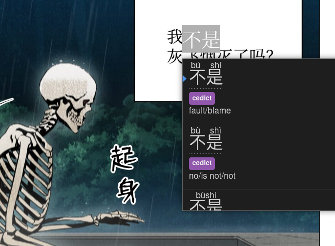

# Swift OCR

A WIP browser addon, optimized towards language learning, that aims to achieve a seamless OCR experience during browsing with 0 manual intervention. The main use case envisioned currently is to read manga hassle-free with your favorite pop-up dictionaries.

## Prototype

The current state of the repository is a prototype of the final product. Here is an example made possible with the prototype:

Because the product is in its development stage, the code currently serves up a web server with webpack, in which testing and new feature development will take place. When it is production-ready, I plan on cleaning up and restructuring the software into a user-friendly browser-addon for both Chrome and Firefox.

## Todo

-   Create spans based off of discrete rectangles (so it works with rotations)
-   Improve alignment in both vertical and horizontal directions
-   Define custom region feature
    -   By default it runs on all images > a certain dimension
-   Dynamically re-compute text on change of region feature
-   Improve speed of computation
-   Improve output quality by cleaning punctuation
